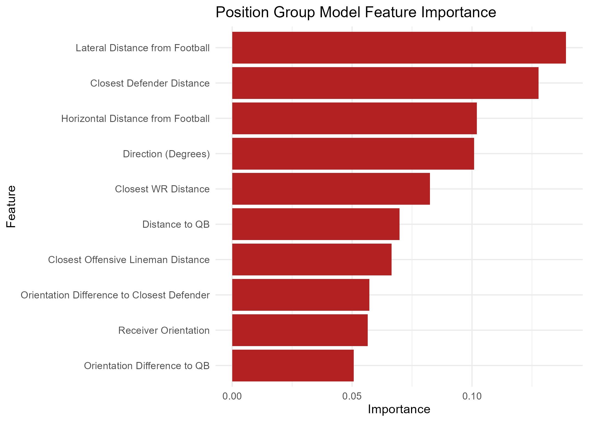

------------------------------------------------------------------------

## Introduction

Think fast! The secret sauce behind the NFL’s screen play is the element of surprise. The play involves the quarterback quickly releasing the ball to a receiver close to the line of scrimmage, with nearby teammates swooping in to block incoming defenders and propel the ball forward. We can see its effectiveness in this play by the Los Angeles Rams in 2022, with Matthew Stafford swiftly delivering the ball to a well-protected Cooper Kupp.


<small>Figure 1. 2022 Week 6 LA vs. CAR screen pass from M. Stafford to C. Kupp </small>

While the screen play is designed to be a reliable and consistent play, its success depends heavily on surprise. If defenders recognize the play before or immediately after the snap, they can quickly target the intended receiver and limit yardage. Take a look at this play by the New York Giants in 2024:

{width="656"}

<small>Figure 2. 2024 Week 1 MIN vs. NY screen pass from D. Jones intercepted for a Pick 6 </small>

Touchdown! ...Vikings??

Linebacker Andrew Ginkel acted on his screen play suspicions by not fully pressuring his offensive lineman, which set up a beautifully executed interception. Accurately predicting screen plays before the snap is an invaluable defensive skill to halt drives, and knowing the offense’s side of attack and likely receiver add an even clearer picture for the defense to capitalize on. 

This paper aims to create a framework to consistently identify high-likelihood screen plays, while also revealing key details on an offense’s pre-planned structures. Using only pre-snap information, we can determine the cues defenses can use to anticipate an offense's intentions and highlight the NFL teams whose screen play tendencies are the easiest to predict.

## Data

Our primary data source is from the 2025 NFL Big Data Bowl[^1], which provides tracking and event level data up to week 9 of the 2022 NFL season.

[^1]: “NFL Big Data Bowl 2025: Overview.” Kaggle, 2024, www.kaggle.com/competitions/nfl-big-data-bowl-2025/overview.

Here is an overview of each type of data provided:

-   **Games:** Each observation represents information on an NFL game, which includes the team involved, the outcome and final score, and the exact date

-   **Players:** Each observation represents a rostered player and includes their main position over the season

-   **Play by Play:** Each observation describes a play’s context and outcome, including the quarter, down, yards to go, and formations.

-   **Player Play:** Each observation describes a player’s role throughout a play, such as whether they were in motion before the snap, attempted or executed a sack, and the route they ran.

-   **Tracking:** Each observation represents a single player at one frame in time, including the player's x- and y-coordinates, speed, orientation, and direction. This animation illustrates the frame-by-frame (10 hz) positioning of all 22 players from pre-snap huddle to the end of the play:

    %20(1)-02.gif){width="701"}

    <small>Figure 3. Player-tracking screen play from 2022 Week 6 LA vs. CAR</small>

Players without clearly recorded pre-snap motion (NAs) on certain plays were assumed to have none. We also used the nflfastR and nflreadr packages, which contain more detailed play by play data dating back to 1999, to extract additional features (e.g., number of defenders in the box), and to explore historical team offensive and defensive tendencies (as seen in Figure 4).

## Exploratory Data Analysis

To get a better understanding of variable interactions and how they relate to our motivations, we explored a variety of features within the data. Identifying these relationships helped us gain of sense of the state of the NFL at the time, team strategies, and teams use their players.

 <small>Figure 4. Team screen play percentage across seasons</small>

Key Takeaways: Using supplementary data from nflfastR and nflreadr, we plotted screen usage trends between teams from 2020 to 2022. The gap between top and bottom teams show a consistent difference throughout the seasons differing by 5-10%. Additionally, the set of team from each season are different but we find patterns of similar teams within multiple years. For example, the Arizona Cardinals is the top team and the Baltimore Ravens is among the bottom from 2020 to 2021. Since teams have varying preferences for using screens, it is important to consider the possession team's tendencies within our model. Taking this into account, any historical probabilities we feature engineering moving forward to predict screen plays occurring will comprise of the previous two years (2020-21) leading up to 2022.

Figure 3. Receiver Group Target Share Based on Lateral Direction of a Screen Play


Key Takeaways: This contingency table shows the target share between receiver groups on the lateral direction of screen plays. Since the p value is greater then 0.05 we can assume that there is no significant difference between the direction of the screen play and which receiver group will be targeted.

## Methodology

For our methodology we decided on a two-stage hierarchical modeling framework:

::: {style="text-align: center;"}
```{mermaid}
flowchart TD
    A["Model 1: Screen Probability<br>Screen or not"] --> B["Model 2: Lateral Direction<br>Left or right"]
    A --> C["Model 3: Target Group<br>RB/TE or WR"]
    
    classDef indianred fill:#CD5B45,color:#ffffff,stroke:#8B3A2B;
    class A,B,C indianred
```
:::

Across all three models, we applied a common set of filters to remove plays where the offense's original intent was compromised or the play didn't count toward a clean result: we excluded QB kneels, QB spikes, and any play nullified by penalty. We also excluded plays beyond the 95th percentile of time-to-throw, to remove scrambles or improvised plays where the original goal of the play had been lost, and excluded all plays run by the Miami Dolphins, since their starting quarterback, Tua Tagovailoa, is left-handed, which could introduce bias into our spatial features.

For the screen probability model, we began with all passing plays, giving us a dataset of about 8,682 plays. After applying the filters above, 6,199 passing plays remained for training/testing the screen probability model.

The lateral direction model and the receiver group model were trained/tested on a further-filtered dataset of screen plays only, where we classified a play as a screen pass if the targeted receiver ran a screen route. Applying the same filters described above, 818 total screen plays were identified, and after the additional exclusions, 755 screen plays remained for training/testing the lateral direction and receiver group models.

For each model, we developed both an **XGBoost** model and a **LASSO logistic** model. **XGBoost** consistently produced more accurate predictions due to the presence of many nonlinear relationships and interaction effects among our pre-snap spatial features, patterns that **LASSO's** linear structure could not capture as effectively.

We also considered **generalized additive models (GAMs)** and **mixed-effects models** as alternatives, but each under-performed relative to our chosen approaches. **GAMs** can capture nonlinear patterns in individual features, but aren't as good at capturing how multiple features interact with each other, which **XGBoost** handles automatically. **Mixed-effects models**, which we considered for incorporating team as a random effect, were constrained by the limited number of observations per team (as few as 9 screen plays for some teams), which is insufficient to reliably estimate team-level variance components and risks unstable or overfit random-effect estimates.

Features in all three models use pre-snap features only. Each model considered key overarching themes of game context, situation factors, team formations, historic tendencies, and spatial factors.

### Model Feature Sets

:::::: panel-tabset
### Screen Probability

::: panel-tabset
#### XGBoost Feature Set


#### Screen probability Model Importance


:::

### Lateral Direction

::: panel-tabset
#### XGBoost Feature Set

.png)

Features isolated for use in LASSO model\*

#### Lateral Direction Model Importance


:::

### Target Receiver Group

::: panel-tabset
#### XGBoost Feature Set

.png)

#### Receiver group Model Importance


:::
::::::

## Results

We evaluated our models using 3-fold cross-validation, with folds defined by week ranges (Weeks 1–3, 4–6, and 7–9). For each fold, the corresponding weeks served as the test set while the model trained on the remaining weeks, preserving separation to prevent data leakage and maintain data integrity.

**Baseline:** Accuracy achievable by simply guessing the most frequent class every time, without using any model or features.

**Accuracy:** Proportion of predictions the model got correct out of all predictions made.

**Kappa:** Measures how much better the model performs than random chance, adjusting for the class distribution. It ranges from -1 to 1, where 0 indicates performance no better than chance and 1 indicates perfect agreement. Kappa is especially useful here because it accounts for class imbalance in a way raw accuracy does not, a model can have high accuracy but low Kappa if it's simply exploiting an imbalanced baseline rather than learning meaningful patterns.

$$
\kappa = \frac{p_o - p_e}{1 - p_e}
$$ where $p_o$ is the observed accuracy and $p_e$ is the expected accuracy under random chance, based on the class distribution.

**ROC AUC:** Measures the model's ability to distinguish between classes across all possible classification thresholds, rather than at a single fixed cutoff. It ranges from 0.5 (no better than random guessing) to 1.0 (perfect separation between classes). Unlike accuracy, ROC AUC is threshold-independent and reflects the model's ability to rank positive cases above negative ones.

$$
\text{AUC} = P(\text{score}(x^+) > \text{score}(x^-))
$$ where $x^+$ and $x^-$ are a randomly chosen positive and negative observation, respectively.

::: panel-tabset
### Screen Probability


### Lateral Direction


**Naive Guess Rate/Baseline = 51.6%**

Key Takeways: From these results we can see that the XGBoost model boosts accuracy from the baseline about

### Target Receiver Group


:::

:::: panel-tabset
### Case Study

{fig-align="center"}

### LOTO Model

For the Leave-One-Team-Out (LOTO) models, we trained on all screen passes excluding a given team, then evaluated on that team's plays as the held-out test set. This procedure was repeated across all teams to produce team-specific performance results.

::: panel-tabset
#### Lateral Direction


Key Takeaways: These results suggest that certain teams are more "predictable" than others, though the analysis is limited by relatively small sample sizes at the team level. Predictability is also inherently bounded by the feature set: since this evaluation uses a LASSO model with only three features, eligible receiver count differential, split asymmetry, and running back lateral position relative to the ball at snap, the model is limited to whatever signal those three variables can capture. For example, when the Eagles show a clear imbalance across these features, they tend to favor that direction the majority of the time, improving prediction accuracy by 33% over simply guessing their most common direction. By contrast, applying the same approach to the Falcons performs over 4% worse than picking their most frequent direction, illustrating the variation in predictability across teams.

#### Reciever Group


:::
::::

## Limitations

### Future Work

## Acknowledgements

This project would not have been possible without the help of Dr. Karim Kassam at Teamworks, whom helped assist and mentor our research process.

We also want to thank Erin Franke, Sara Colando, Dr. Ron Yurko and the CMSACamp TAs for their guidance as well as Quang Nguyen for distributing the data resources needed to conduct our study.

## Appendix:

## Contact Information

Krish Bothra, University of Wisconson-Madison, krishbothra3\@gmail.com

Ethan Larimore, Rice University, el115\@rice.edu

Jenna Lau, University of Texas at Austin, jennaaa.wl\@gmail.com
