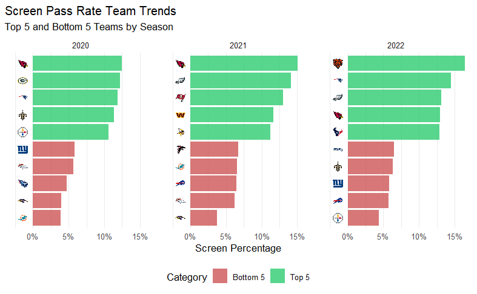
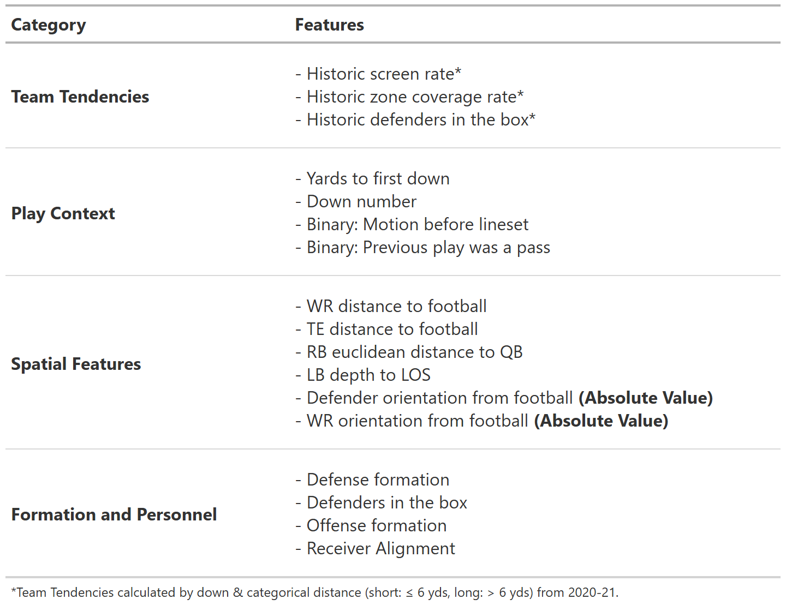
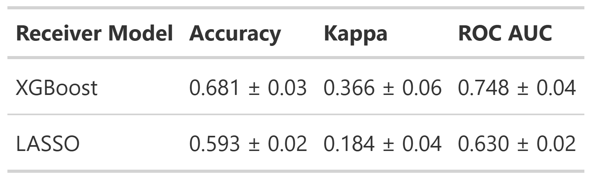
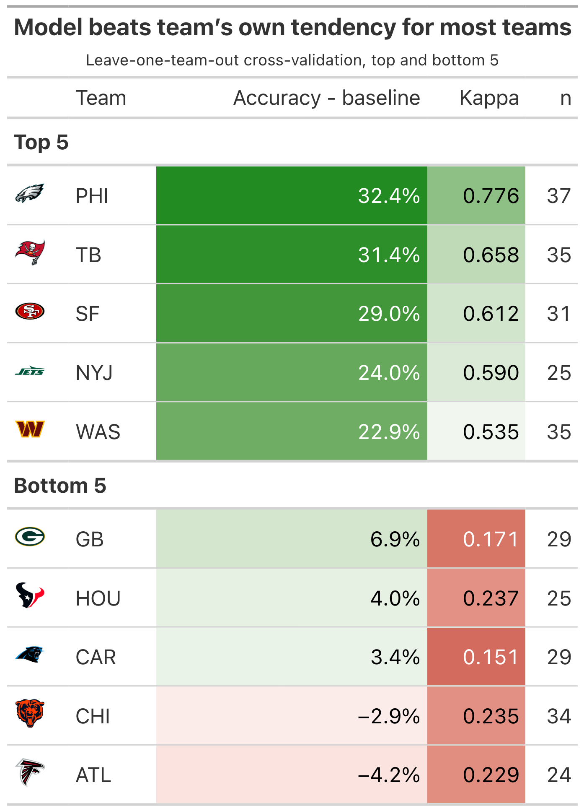
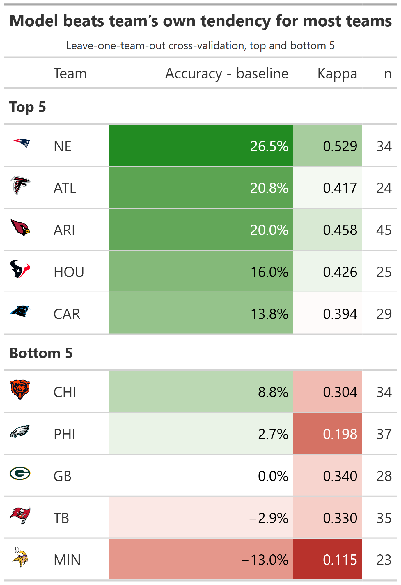

------------------------------------------------------------------------

## Introduction

Think fast! The secret sauce behind the NFL’s screen play is the element of surprise. The play involves the quarterback quickly releasing the ball to a receiver close to the line of scrimmage, with nearby teammates swooping in to block incoming defenders and propel the ball forward. We can see its effectiveness in this play by the Los Angeles Rams in 2022, with Matthew Stafford swiftly delivering the ball to a well-protected Cooper Kupp.

{width="900"}

<small>Figure 1. 2022 Week 6 LA vs. CAR screen pass from M. Stafford to C. Kupp </small>

While the screen play is designed to be a reliable and consistent play, its success depends heavily on surprise. If defenders recognize the play before or immediately after the snap, they can quickly target the intended receiver and limit yardage. Take a look at this play by the New York Giants in 2024:

{width="900"}

<small>Figure 2. 2024 Week 1 MIN vs. NY screen pass from D. Jones intercepted for a Pick 6 </small>

Touchdown! ...Vikings??

Linebacker Andrew Ginkel acted on his screen play suspicions by not fully pressuring his offensive lineman, which set up a beautifully executed interception. Accurately predicting screen plays before the snap is an invaluable defensive skill to halt drives, and knowing the offense’s side of attack and likely receiver adds an even clearer picture for the defense to capitalize on. 

This paper aims to create a framework to consistently identify high-likelihood screen plays, while also revealing key details on an offense’s pre-planned structures. Using only pre-snap information, we can determine the cues defenses can use to anticipate an offense's intentions and highlight the NFL teams whose screen play tendencies are the easiest to predict.

## Data

Our primary data source is from the 2025 NFL Big Data Bowl[^1], which provides tracking and event level data up to week 9 of the 2022 NFL season.

[^1]: “NFL Big Data Bowl 2025: Overview.” Kaggle, 2024, www.kaggle.com/competitions/nfl-big-data-bowl-2025/overview.

Here is an overview of each type of data provided:

-   **Games:** Each observation represents information on an NFL game, which includes the team involved, the outcome and final score, and the exact date

-   **Players:** Each observation represents a rostered player and includes their main position over the season

-   **Play by Play:** Each observation describes a play’s context and outcome, including the quarter, down, yards to go, and formations.

-   **Player Play:** Each observation describes a player’s role throughout a play, such as whether they were in motion before the snap, attempted or executed a sack, and the route they ran.

-   **Tracking:** Each observation represents a single player at one frame in time, including the player's x- and y-coordinates, speed, orientation, and direction. This animation illustrates the frame-by-frame (10 hz) positioning of all 22 players from pre-snap huddle to the end of the play:

    %20(1)-02.gif){width="701"}

    <small>Figure 3. Player-tracking screen play from 2022 Week 6 LA vs. CAR</small>

Players without clearly recorded pre-snap motion (NAs) on certain plays were assumed to have none. We also used the nflfastR and nflreadr packages, which contain more detailed play by play data dating back to 1999, to extract additional features (e.g., number of defenders in the box), and to explore historical team offensive and defensive tendencies (as seen in Figure 4).

## Exploratory Data Analysis

To get a better understanding of variable interactions and how they relate to our motivations, we explored a variety of features within the data. Identifying these relationships helped us gain of sense of the state of the NFL at the time, team strategies, and teams use their players.

::: {style="text-align: center;"}


<small> Figure 4. Team screen play percentage across seasons</small>
:::

Using supplementary data from nflfastR and nflreadr, we plotted screen usage trends between teams from 2020 to 2022. The gap between top and bottom teams show a consistent difference throughout the seasons differing by 5-10%. Additionally, the set of teams from each season are different but we find patterns of similar teams within multiple years. For example, the Arizona Cardinals is the top team and the Baltimore Ravens is among the bottom from 2020 to 2021. Since teams have varying preferences for using screens, it is important to consider the possession team's tendencies within our model. Taking this into account, any historical probabilities we feature engineer moving forward to predict screen plays occurring will comprise of the previous two years (2020-21) leading up to 2022.

::: {style="text-align: center;"}
{width="75%"}

<small>Figure 5. Receiver Group Target Share Based on Lateral Direction of a Screen Play</small>
:::

This contingency table shows the target share between receiver groups on the lateral direction of screen plays. Since the p value is greater then 0.05 we can assume that there is no significant difference between the direction of the screen play and which receiver group will be targeted.

## Methodology

For our methodology we decided on a two-stage hierarchical modeling framework:

::: {style="text-align: center;"}
```{mermaid}
flowchart TD
    A["Model 1: Screen Probability<br>Screen or not"] --> B["Model 2: Lateral Direction<br>Left or right"]
    A --> C["Model 3: Target Group<br>RB/TE or WR"]
    
    classDef indianred fill:#CD5B45,color:#ffffff,stroke:#8B3A2B;
    class A,B,C indianred
```
:::

Across all three models, we applied a common set of filters to remove plays where the offense's original intent was compromised or the play didn't count toward a clean result: we excluded QB kneels, QB spikes, and any play nullified by penalty. We also excluded plays beyond the 95th percentile of time-to-throw, to remove scrambles or improvised plays where the original goal of the play had been lost, and excluded all plays run by the Miami Dolphins, since their starting quarterback, Tua Tagovailoa, is left-handed, which could introduce bias into our spatial features.

For the screen probability model, we began with all passing plays, giving us a dataset of about 8,682 plays. After applying the filters above, 6,199 passing plays remained for training/testing the screen probability model.

The lateral direction model and the receiver group model were trained/tested on a further-filtered dataset of screen plays only, where we classified a play as a screen pass if the targeted receiver ran a screen route. Applying the same filters described above, 818 total screen plays were identified, and after the additional exclusions, 755 screen plays remained for training/testing the lateral direction and receiver group models.

For each model, we developed both an XGBoost model and a LASSO logistic model. XGBoost consistently produced more accurate predictions due to the presence of many non-linear relationships and interaction effects among our pre-snap spatial features, patterns that LASSO's linear structure could not capture as effectively.

We also considered generalized additive models (GAMs) and mixed-effects models as alternatives, but each under-performed relative to our chosen approaches. GAMs can capture non-linear patterns in individual features, but aren't as good at capturing how multiple features interact with each other, which XGBoost handles automatically. Mixed-effects models, which we considered for incorporating team as a random effect, were constrained by the limited number of observations per team (as few as 9 screen plays for some teams), which is insufficient to reliably estimate team-level variance components and risks unstable or overfit random-effect estimates.

Features in all three models use pre-snap features only. Each model considered key overarching themes of game context, situation factors, team formations, historic tendencies, and spatial factors.

### Model Feature Sets

:::::: panel-tabset
### Screen Probability

::: panel-tabset

#### XGBoost Feature Set

Model 1’s feature set focused on team tendencies, spatial positioning, play context, and personnel information. Through EDA, offensive and defensive strategies varied across teams and seasons, so we engineered team-level situation tendency variables such as historical screen and coverage type rates using the supplementary data from 2020-21. Additionally, due to the sequential nature of the game, we attempted to capture some of its effects by creating a previous play type (run or pass) lag variable. The spatial positioning of defensive and offensive players were generated using tracking data at the snap of the play and measured lateral distance, depth and body orientation of players from the football. Finally, personnel information consists of offensive and defensive groupings and formations that capture the structure of the players on field. 



#### Screen probability Model Importance


:::

### Lateral Direction

::: panel-tabset
#### XGBoost Feature Set

Pre-snap features for this model were chosen to anticipate what side of the field an offense is likely to attack. Formation numbers matter, a difference in eligible receiver count, for instance, reflects the simple logic that offenses tend to direct plays toward the side with more blockers and receivers. Spacing offers a similar signal, as how wide the field gets towards one side or another can be a big tell as to where the offense is planning to go. Alignment cues add a more direct tell, running back lateral position at the snap is one example, as backs are frequently positioned toward the side they're expected to work to.

.png)

\*Features isolated for use in LASSO model

#### Lateral Direction Model Importance


:::

### Target Receiver Group

::: panel-tabset
#### XGBoost Feature Set

For Model 3 (predicting target receiver group), game context features such as down and yards to go contributed minimally to predictive performance. This reflects how screen plays are designed: the receiving target is primarily a product of blocker positioning and spacing, not the target’s individual skill or the game situation. This motivated the implementation of spatial features, such as each receiver's distance to nearby defenders, offensive linemen, and other receivers, to capture the non-linear, interconnected relationships that help identify potential targets with well-positioned blockers. Tracking data further allowed us to include each receiver's depth and horizontal distance relative to the football at the snap, which helped distinguish spaced-out wide receivers from shotgun-aligned running backs or blocking tight ends who are unlikely to be the intended target. 


.png)

#### Receiver group Model Importance


:::
::::::

## Results

We evaluated our models using 3-fold cross-validation, with folds defined by week ranges (Weeks 1–3, 4–6, and 7–9). For each fold, the corresponding weeks served as the test set while the model trained on the remaining weeks, preserving separation to prevent data leakage and maintain data integrity.

Before getting into model evaluation these are the diagnostics we're using

**Baseline:** Accuracy achievable by simply guessing the most frequent class every time, without using any model or features.

**Accuracy:** Proportion of predictions the model got correct out of all predictions made.

**Cohen's kappa:** Measures how much better the model performs than random chance, adjusting for the class distribution. It ranges from -1 to 1, where 0 indicates performance no better than chance and 1 indicates perfect agreement. Kappa is especially useful here because it accounts for class imbalance in a way raw accuracy does not; a model can have high accuracy but low Kappa if it's simply exploiting an imbalanced baseline rather than learning meaningful patterns.

$$
\kappa = \frac{p_o - p_e}{1 - p_e}
$$ where $p_o$ is the observed accuracy and $p_e$ is the expected accuracy under random chance, based on the class distribution.

**ROC AUC:** Measures the model's ability to distinguish between classes across all possible classification thresholds, rather than at a single fixed cutoff. It ranges from 0.5 (no better than random guessing) to 1.0 (perfect separation between classes). Unlike accuracy, ROC AUC is threshold-independent and reflects the model's ability to rank positive cases above negative ones.

$$
\text{AUC} = P(\text{score}(x^+) > \text{score}(x^-))
$$ where $x^+$ and $x^-$ are a randomly chosen positive and negative observation, respectively.

:::::: panel-tabset
### Screen Probability

::: {style="text-align: center;"}

:::

**Naive Guess Rate/Baseline = 12.1%**

The XGBoost model outperformed the LASSO model across all three evaluation metrics. Due to the severe class imbalance inherent in screen pass detection, which occurs around 12% of the time, relying on overall accuracy can be misleading, making metrics like the F1-Score and Cohen’s Kappa statistic more informative for evaluation. Our XGBoost model achieved the highest F1-Score of 0.325, implying it performs better than the LASSO model at identifying the minority class. Furthermore, it achieved the highest Kappa score of 0.268, indicating that the model captures 26.8% of the maximum possible performance beyond chance agreement. 

### Lateral Direction

::: {style="text-align: center;"}
{width="75%"}
:::

**Naive Guess Rate/Baseline = 51.6%**

The LASSO logistic model was selected for the lateral direction task despite XGBoost's modest edge in raw performance, as the two models perform closely enough that interpretability becomes the deciding factor. With a baseline of 51.6% (the majority-direction guess rate for screen plays), XGBoost improves accuracy by roughly 18.7 percentage points, while LASSO improves it by roughly 16.8 percentage points — a gap of less than 2 points. Kappa values of 0.406 for XGBoost and 0.364 for LASSO confirm that both models are learning genuine patterns from pre-snap alignment rather than exploiting class imbalance, and both rank a randomly selected left-direction play above a randomly selected right-direction play correctly roughly 75% of the time (ROC AUC of 0.758 and 0.747, respectively). Given this near-equivalent performance, we favor LASSO's three-feature simplicity (*difference in eligible receiver count*, *split asymmetry*, and *RB lateral position relative to football*) over XGBoost's added complexity, since it allows coaches and players to understand and act on the model's reasoning in real time, rather than treating it as a black box.

### Target Receiver Group

::: {style="text-align: center;"}
{width="75%"}
:::

**Naive Guess Rate/Baseline = 50.3%**

The XGBoost model was selected as it significantly outperformed the LASSO across all three week-based folds, reflecting the non-linear relationships of spatial features, such as each receiver’s lateral distance from the football, and the predicted receiver group. With a baseline of roughly 50% (an even split between WR and non-WR target share on screen plays), our model does 18% better than simply assuming the ball is going to a WR. The model is not exploiting class imbalances to inflate accuracy, reflected by a robust Kappa of 0.366. It also correctly ranks randomly selected WR-targeted plays above randomly selected non-WR-targeted plays roughly 75% of the time. Taken together, these metrics indicate the XGBoost model has learned meaningful patterns from pre-snap alignments, making it a valuable tool to predict the targeted position group.
::::::

### Case Study

::: {style="text-align: center;"}
{width="40%"}

:::

In this 3rd and 13 situation for the Rams, our model framework demonstrated its capability of evaluating a play using pre-snap features driven by play context and spatial positioning. Model 1 highlights a strong screen probability of 58.9%. Model 2 then predicts the screen is 62.9% likely to go to the right, and Model 3 anticipates a 55.8% chance that the targeted reciever group are the WRs. This application illustrates how coaches can isolate high-probability screen plays when prepping for future games.

### LOTO Model

For the Leave-One-Team-Out (LOTO) models, we trained on all screen passes excluding a given team, then evaluated on that team's plays as the held-out test set. This procedure was repeated across all teams to produce team-specific performance results.

::::: panel-tabset
#### Lateral Direction - LASSO

::: {style="text-align: center;"}
{width="60%"}
:::

These results suggest that certain teams are more "predictable" than others, though the analysis is limited by relatively small sample sizes at the team level. Predictability is also inherently bounded by the feature set: since this evaluation uses a LASSO model with only three features, eligible receiver count differential, split asymmetry, and running back lateral position relative to the ball at snap, the model is limited to whatever signal those three variables can capture. For example, when the Eagles show a clear imbalance across these features, they tend to favor that direction the majority of the time, improving prediction accuracy by 33% over simply guessing their most common direction. By contrast, applying the same approach to the Falcons performs over 4% worse than picking their most frequent direction, illustrating the variation in predictability across teams.

#### Receiver Group - XGBoost

::: {style="text-align: center;"}
{width="60%"}
:::

A similar spread is found when analyzing each team’s predictability for targeting a position group with the XGBoost model. New England and Arizona posted notably high Kappa scores, which help rule out class imbalance as a driver of their elevated accuracy. Feature-level analysis suggests that defender distance and the receiver's horizontal and lateral distance from the football are most responsible for these two teams' high predictability. However, these spatial features are more difficult to interpret and isolate actionable “tells” for the defense, which is grounds for future work.


:::::


## Discussion

By developing an XGBoost and LASSO modeling framework to predict screen pass decisions using pre-snap features, we are able to predict the direction of a screen play 19% better than naive guessing, and the targeted receiver group 18% better. We also crafted team-level metrics for predictability in screen direction and targeted receiver group, helping identify which teams' screen tendencies are most tied to interpretable model features. This is especially valuable heading into the playoffs, when a full season of data would provide the most accurate picture of an opponent's screen tendencies.

## Limitations

Our primary limitation is data availability: our models were trained and tested exclusively on Weeks 1-9 of the 2022 NFL season. Our current estimates of each team's screen predictability would benefit from a full season of tracking data, as the present sample includes a relatively small number of screen plays per team. Additionally, our models may not fully capture how a defense's pre-snap look influences an offense's decision to run a screen. For instance, an inferred coverage feature could meaningfully improve prediction but is not included here. Finally, because offensive strategy is tied to annual roster turnover, our framework's generalizability is largely confined to the season in which it is trained and applied.

### Future Work

Looking ahead, we would like to incorporate sequential models that estimate the likelihood of a screen, along with its direction and target position group, as a continuous probability from the offensive huddle through the snap. This would allow us to identify which pre-snap spatial movements are “tells” for a screen, offering an interpretable and valuable signal for NFL defenses. With continued work, we believe our screen-prediction models and team-level predictability metrics can serve as informative tools to help defenses anticipate, disguise against, and neutralize the screen pass.

## Acknowledgements

This project would not have been possible without the help of Dr. Karim Kassam at Teamworks, whom helped assist and mentor our research process.

We also want to thank Erin Franke, Sara Colando, Dr. Ron Yurko and the CMSACamp TAs for their guidance as well as Quang Nguyen for distributing the data resources needed to conduct our study.

## Contact Information

Krish Bothra, University of Wisconsin-Madison, krishbothra3\@gmail.com, krishbothra.github.io

Ethan Larimore, Rice University, elarimore16\@gmail.com, elarimore.github.io

Jenna Lau, University of Texas at Austin, jennaaa.wl\@gmail.com, jennaxlauu.github.io 
