## Introduction

::: {layout="[[1], [ -1 ]]"}
Since 2010, the proportion of passing plays being screens in the NFL has increased from 7.5% to over 10%
:::

::: {.column width="50%"}
{fig-align="left" width="450" height="330"}
:::

::: {.column width="50%"}
### Goals:

Predict likelihood a screen pass occurs using pre-snap features

-   Identify lateral location
-   Identify target receiver group
:::

## Motivating Example: LA vs. CAR

{fig-align="center"}

## Data Overview

::: {layout="[[1]]"}
**Sources:** NFL Big Data Bowl 2025, nflfastR & nflreadr packages

**Model Observations:** 2022 Passing Plays from Weeks 1-9
:::

::: {.column width="50%"}
### Data Subsets:

-   Game
-   Play by Play
-   Player play
-   Tracking
:::

::: {.column width="50%"}
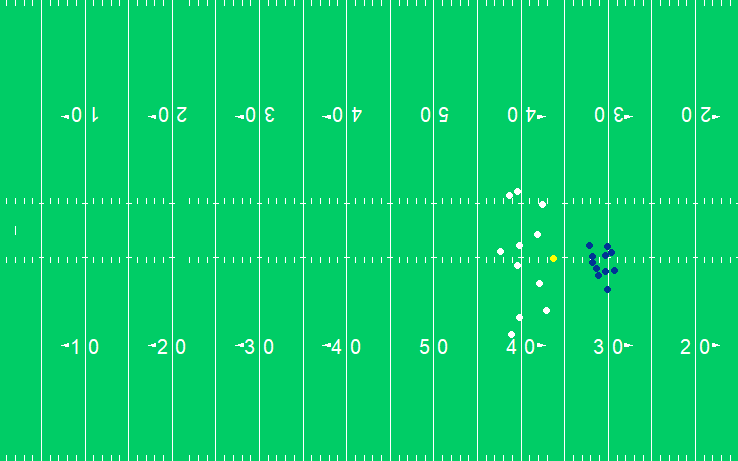{fig-align="left"}
:::

## Plan of Action

::: {layout="[[1], [ -1 ]]"}
-   [x] Data Exploration
-   [x] Feature Engineering
-   [x] Model Evaluation & Selection
-   [x] Interpret Results
-   [ ] Combine Models
-   [ ] Interactive Team-Facing Product
:::

## Team Tendencies over Time

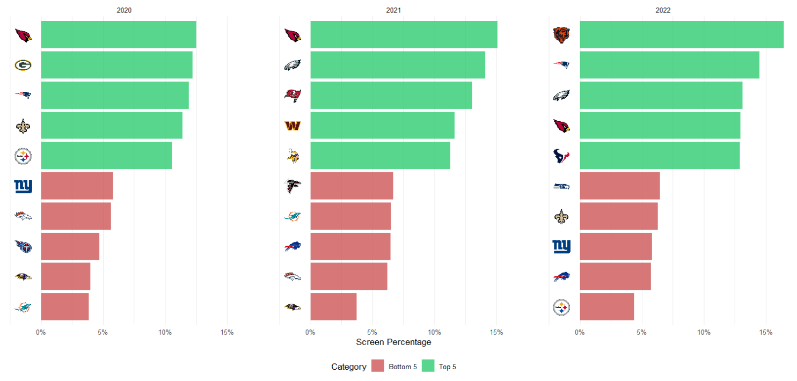

## Symmetrical Target Distribution

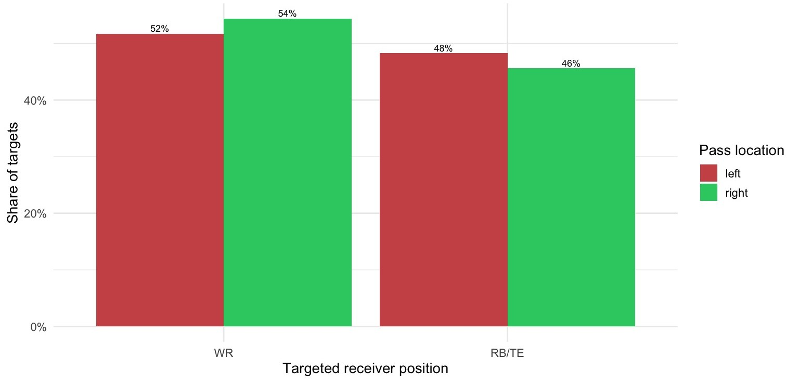

One sample t-test results: WR (*p* = 0.608), RB/TE (*p* = 0.641)

## Methods

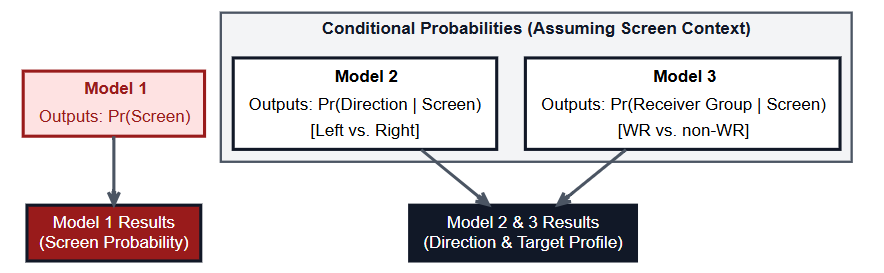{fig-align="center" height="450"}

## Model 1: Screen Probability

**Feature Set Overview:**

-   Team Tendencies (%): Screens, man/zone coverage
-   Situation: Down & distance
-   Spatial Factors: Receiver distance

## Model 2 & 3: Conditional Probabilities

::::: {.columns style="display: flex; align-items: center;"}
::: {.column width="60%"}
**Lateral Direction:**

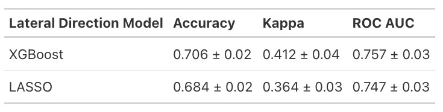

**Receiver Group:**

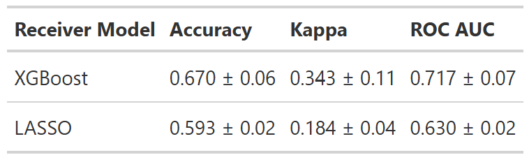
:::

::: {.column width="40%"}
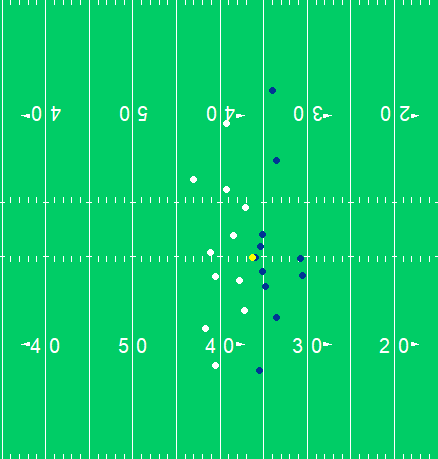{fig-align="center"}
:::
:::::

## Results: Case Study

::: {.column width="35%"}

:::

::: {.column width="65%"}
{fig-align="default"}
:::

## Model Beats Team's own Tendency

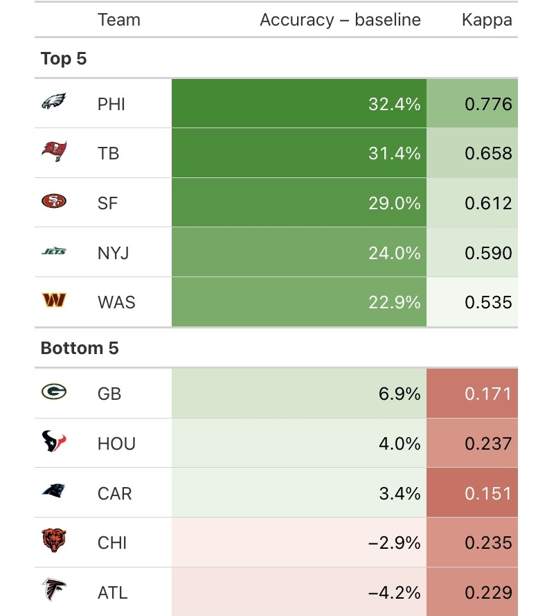{fig-align="center"}

## Discussion

XGBoost modeling framework to predict screen pass tendencies for coach-usable insights

::: {style="margin-top: 1.5em;"}
:::

**Limitations:** Relying on NFL Weeks 1- 9 to train models

::: {style="margin-top: 1.5em;"}
:::

**Future Work:**

-   Use multiple years of data

-   Sequential models for continuous pre-snap probability

## Plan of Action

::: {layout="[[1], [ -1 ]]"}
-   [ ] Data Exploration
-   [ ] Feature Engineering
-   [ ] Model Evaluation & Selection
-   [ ] Interpret Results
-   [ ] Combine Models
-   [ ] Interactive Team-Facing Product
:::

## Appendix

::: {.column width="50%"}
LOTO Model VIP:

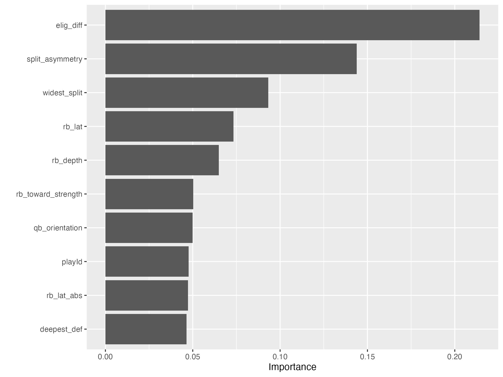{fig-align="center"}
:::

::: {.column width="50%"}
Lateral Distance Model VIP:

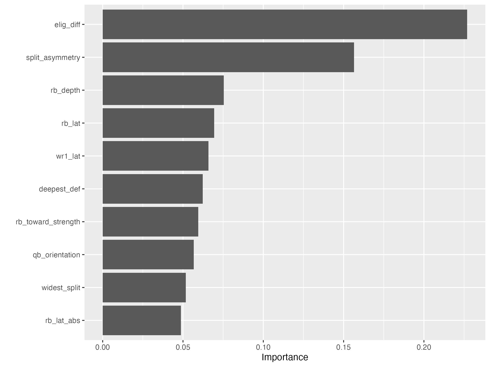{fig-align="center"}
:::

## Appendix Continued

::: {.column width="50%"}
Receiver Group Model VIP:

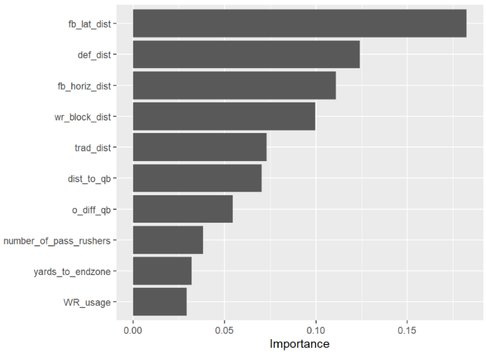
:::

::: {.column width="50%"}
Screen Model VIP:

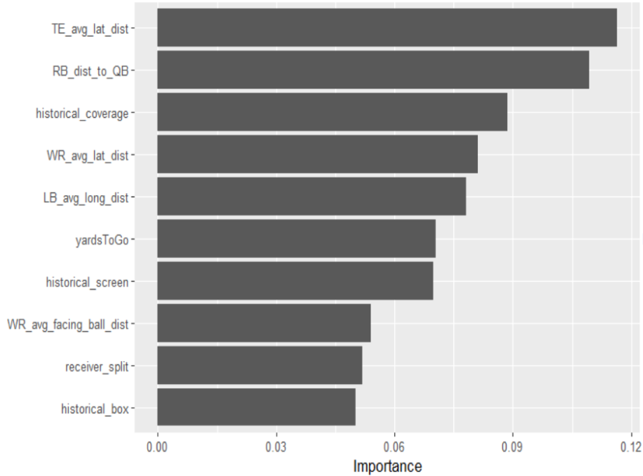
:::
