## Introduction

::: {layout="[[1], [ -1 ]]"}
Since 2010, the proportion of passing plays being screens in the NFL has increased from 7.5% to over 10%
:::

::: {.column width="50%"}
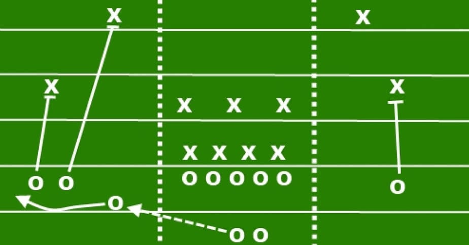{fig-align="left" width="450" height="330"}
:::

::: {.column width="50%"}
### Goals:

Predict likelihood a screen pass occurs using pre-snap features

-   Identify lateral location
-   Identify target receiver group
:::

## Motivating Example: LA vs. CAR

{fig-align="center"}

## Data Overview

::: {layout="[[1]]"}
**Sources:** NFL Big Data Bowl 2025, nflfastR & nflreadr packages

**Model Observations:** 2022 Passing Plays from Weeks 1-9
:::

::: {.column width="50%"}
### Data Subsets:

-   Game
-   Play by Play
-   Player play
-   Tracking
:::

::: {.column width="50%"}
%20(1).gif){fig-align="left"}
:::

## No Significant Difference Between Share of Screen Targets by Position & Direction

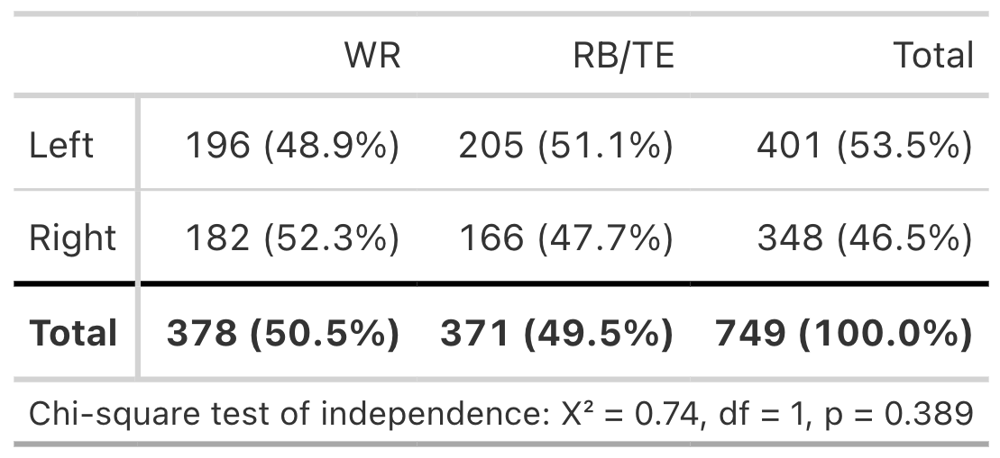{fig-align="center"}

## Modeling Approach

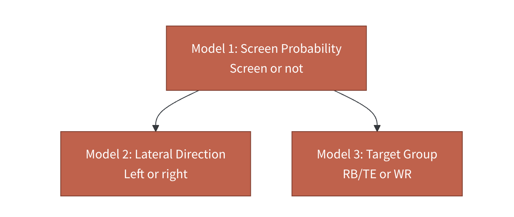{fig-align="center" width="700" height="auto"}

**Methodology:**

-   Compare LASSO and XGBoost models
-   3-Fold Cross Validation
-   Evaluation Metrics: Accuracy, Kappa, ROC AUC

## Model 1, Screen Probability:

**Feature Set Overview:**

-   Team-Level Historic Tendencies
-   Play Context
-   Spatial Positioning

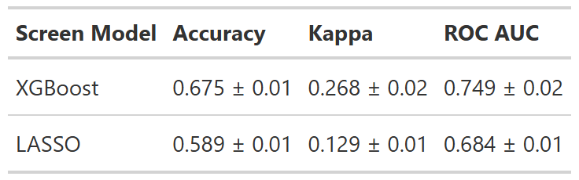

## Conditional Probabilities:

::::: {.columns style="display: flex; align-items: center;"}
::: {.column width="60%"}
**Model 2, Lateral Direction:**

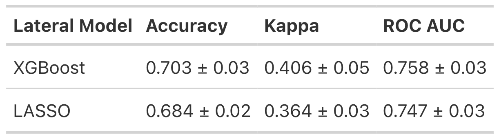

**Model 3, Receiver Group:**

:::

::: {.column width="40%"}
.gif){fig-align="center"}
:::
:::::

## Case Study Application

::: {.column width="35%"}
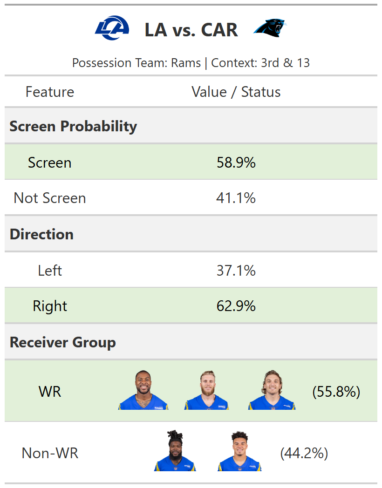{width="820"}
:::

::: {.column width="65%"}
{fig-align="default"}
:::

## Model Predictability by Team

::: {.column width="50%"}
**Lateral Direction:**

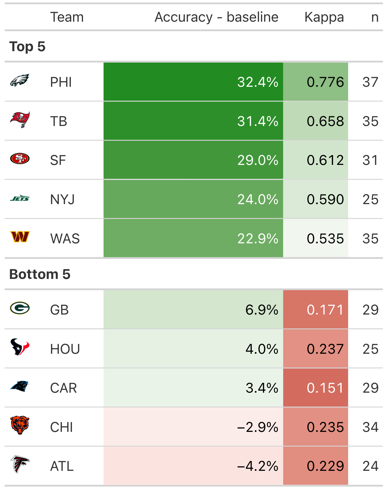{width="396"}
:::

::: {.column width="50%"}
**Target Receiver Group:**

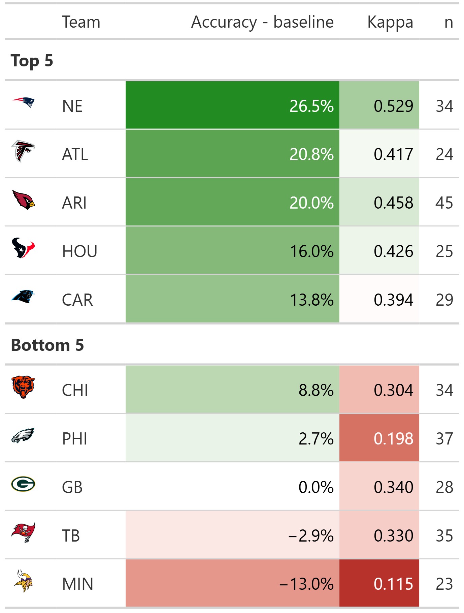{width="394" height="500"}
:::

## Discussion

XGBoost/LASSO hierarchical modeling framework to predict screen pass tendencies for coach-usable insights

::: {style="margin-top: 1.5em;"}
:::

**Limitations:**

-   Sparse number of single-season screen plays per team

-   Player turnover within teams

**Future Work:**

-   Sequential models for continuous pre-snap probability

-   Find individual teams’ pre-snap “tells”

## Acknowledgements

Special thanks to Karim Kassam, Erin Franke, Sara Colando, Dr. Ron Yurko, Quang Nguyen, and the CMSACamp TAs for their guidance throughout our study.

## Appendix

Lateral Distance Model VIP:

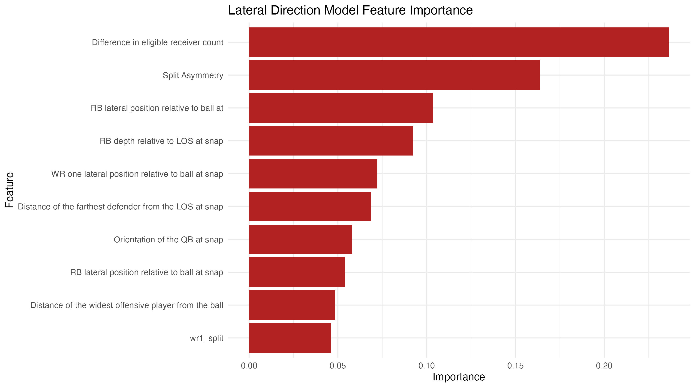{fig-align="center"}

## Appendix Continued

::: {.column width="50%"}
Receiver Group Model VIP:

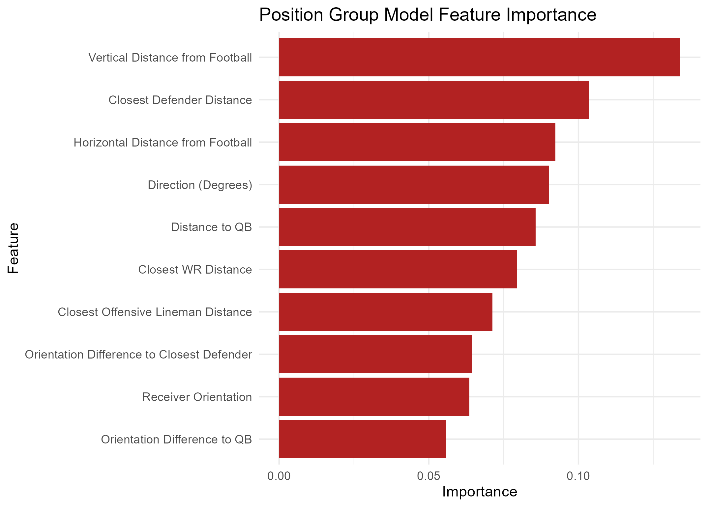
:::

::: {.column width="50%"}
Screen Model VIP:

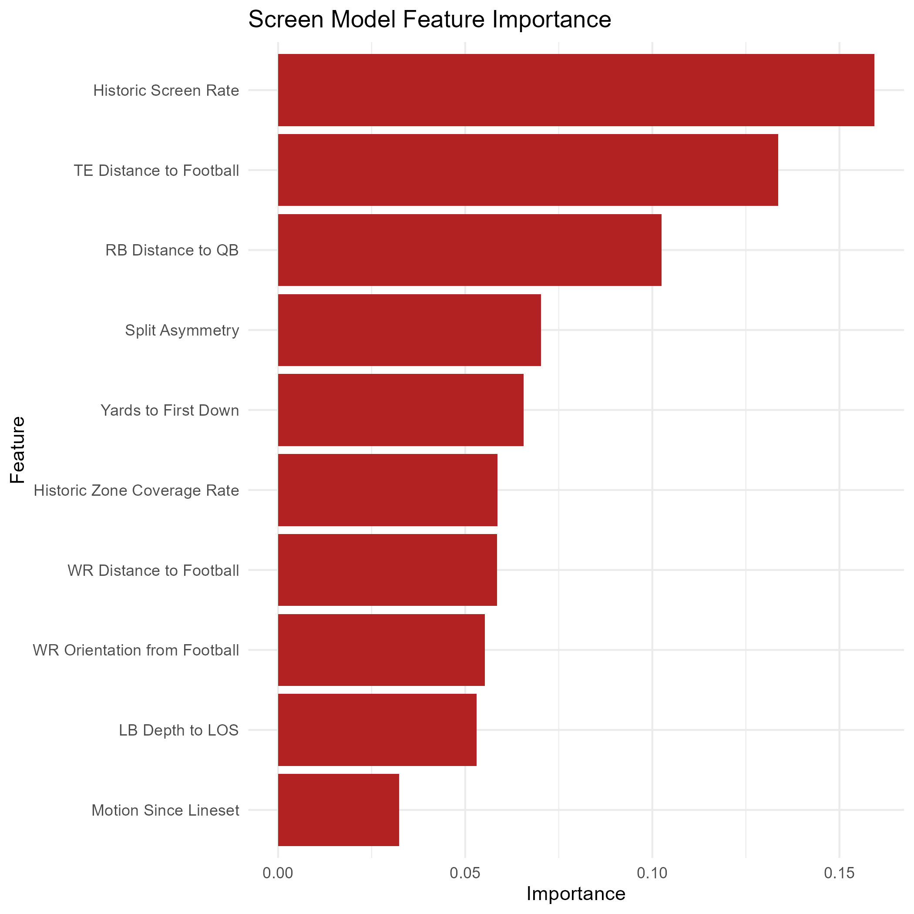
:::
